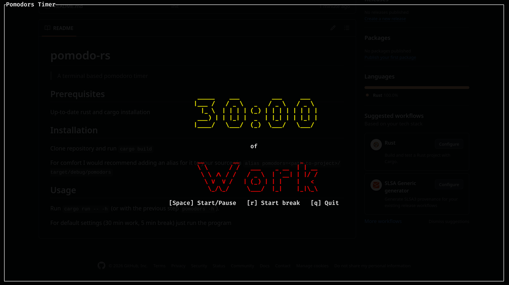

# pomodo-rs

> A terminal-based pomodoro timer
## Prerequisites

Up-to-date Rust and cargo installation

## Installation

Clone the repository and run `cargo build`

For comfort, I would recommend adding an alias for it to your source via `alias pomodors=<path-to-project>/target/debug/pomodors`

## Usage

Run `cargo run -- -h` (or with the previous step `pomodors -h`).

For default settings (30 min work, 5 min break), just run the program
